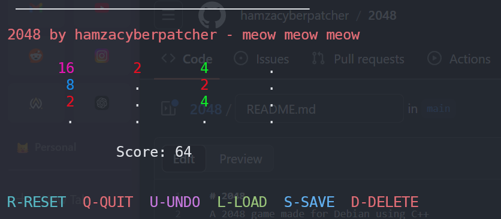

# 2048
A 2048 game made for Debian using C++




To build this project
```
make
cd build
./2048
```

The colors in this game are being displayed using the termcolor.hpp file which can be found at https://github.com/ikalnytskyi/termcolor/tree/master

There can be many bugs so I beg your pardon for that me just a stupid 17 yo doing this for fun

The game has undo, reset, save, load features as well

It uses classes to make the board and running the game, idk whats the appropriate word for it maybe its object oriented programming i guess

If u have a cat do pet it for me

meow meow meow
